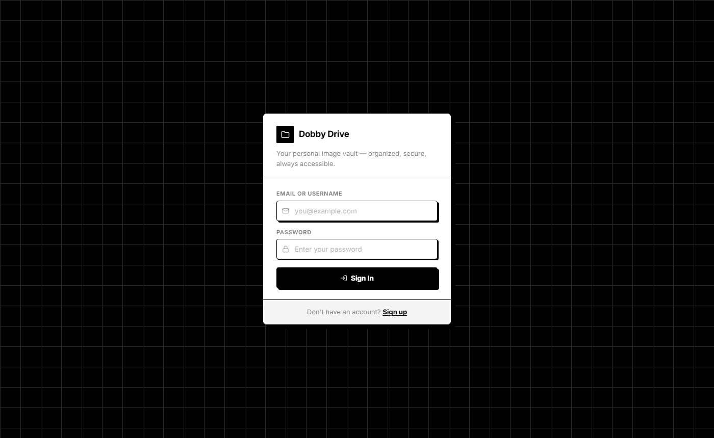
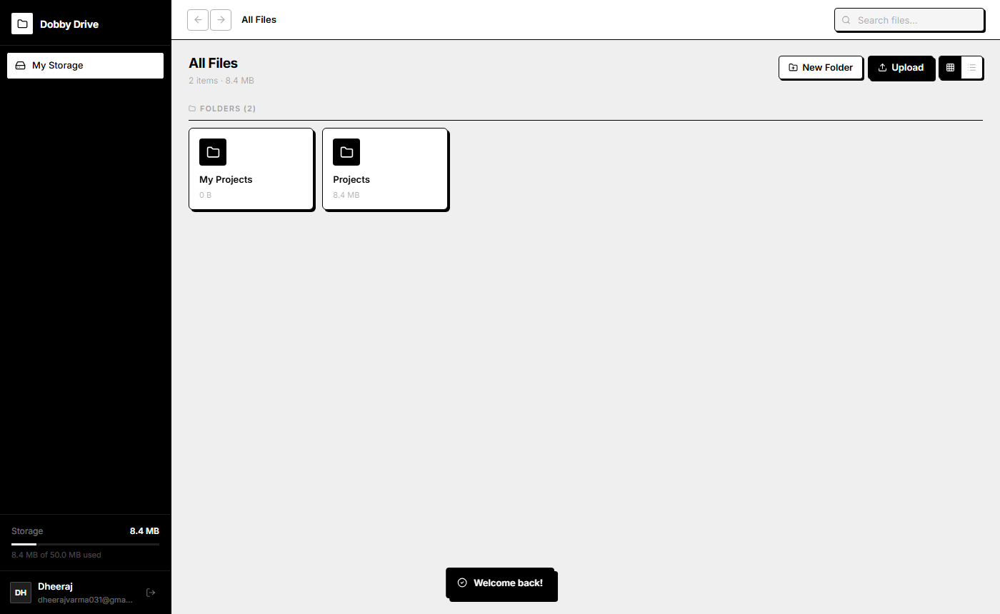
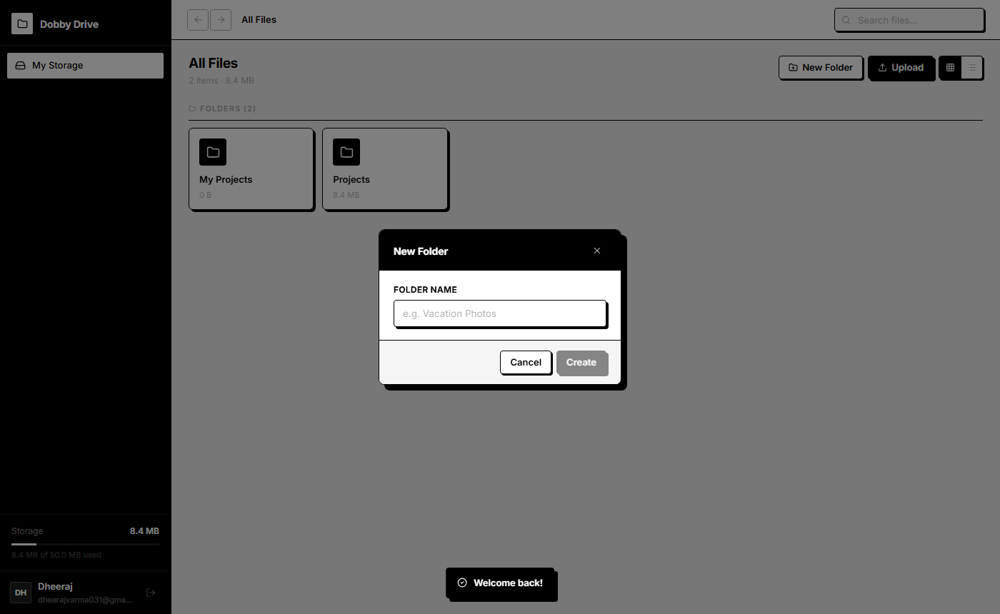
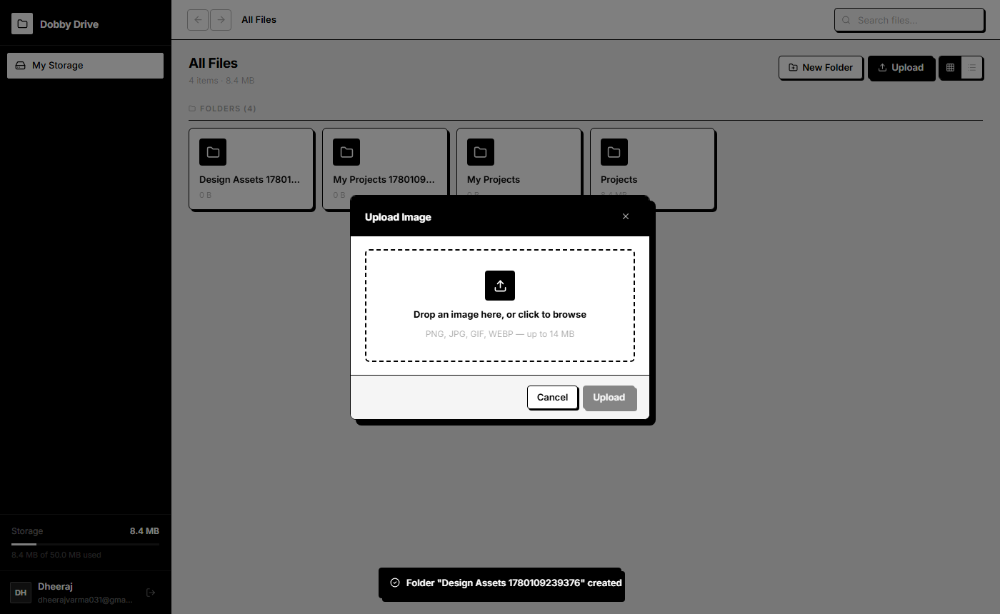
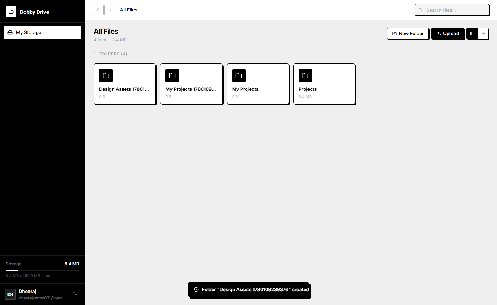
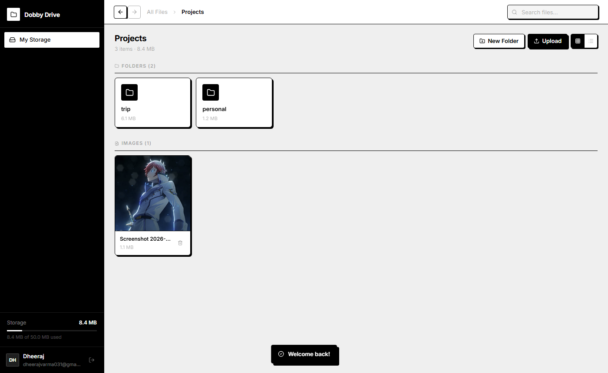
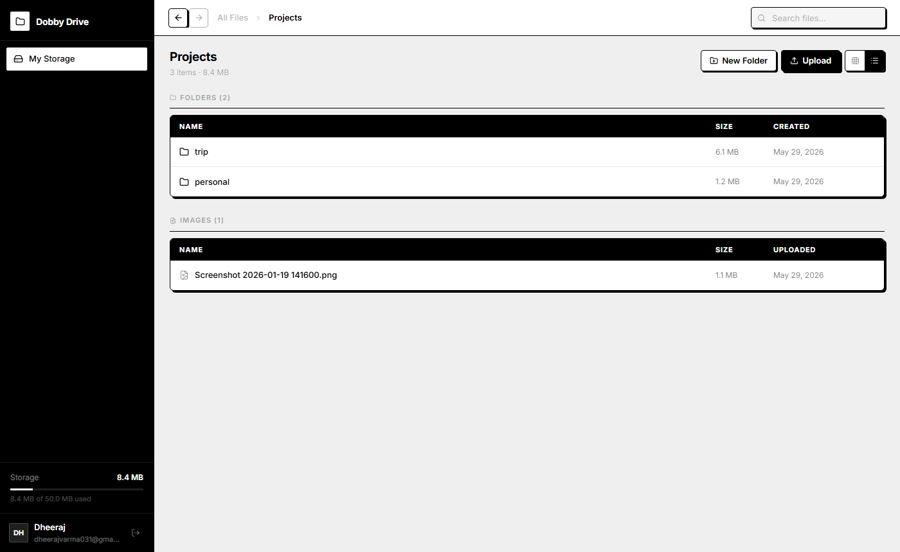
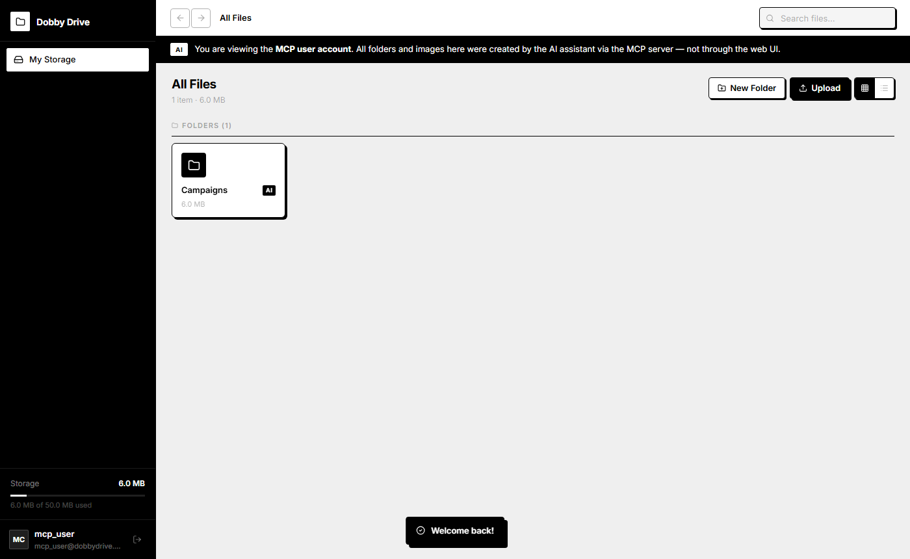
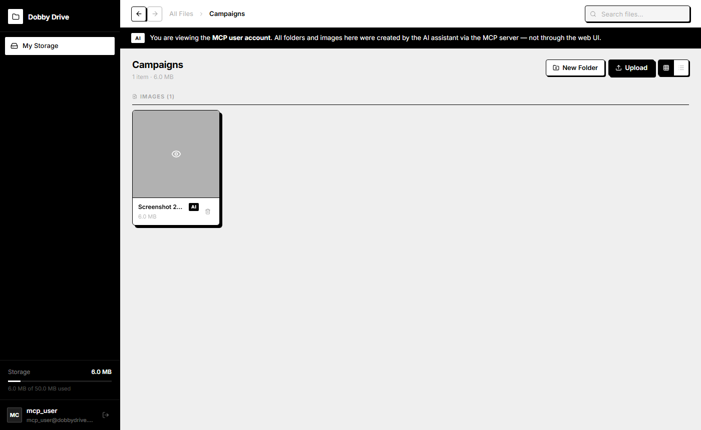

# Dobby Drive


> A secure, full-stack image storage and folder management web application - built with React, Node.js, and MongoDB. Organize your images into nested folders, track storage usage in real time, and control access to your own content. Ships with an MCP server that exposes core actions as AI-callable tools.

🚀 **Live Demo**: [https://dobby-drive-ivory.vercel.app/](https://dobby-drive-ivory.vercel.app/)


---

## Screenshots

### Login Page
> Animated moving grid background with a clean, minimal auth card floating on top.



---

### Dashboard - Empty State
> Clean dashboard on first login. Black sidebar shows your username, email, and storage meter. Back/forward arrows at the top left for folder navigation.



---

### Create Folder Modal
> Minimal modal with a hard-shadow retro style. Type a name and press Create - folders appear instantly without a page reload.



---

### Upload Image Modal
> Drag and drop zone for uploading images. Supports PNG, JPG, GIF, and WEBP up to 14 MB. Optionally rename the image before saving.



---

### Dashboard - With Content
> Folders displayed in a card grid. Each card shows folder name and recursive total size. Storage meter in the sidebar updates in real time. Toast notification confirms the last action.



---

### Folder with Images & Nested Folders
> Inside the **Projects** folder - 2 subfolders (`trip`, `personal`) with their recursive sizes shown, plus 1 uploaded image rendered as a thumbnail card. Breadcrumb shows `All Files > Projects`. Folder sizes update automatically as images are added deeper in the hierarchy.



---

### List View
> Switch to list view for a tabular layout showing name, size, and date for both folders and images. The black header row makes columns easy to scan. Back/forward navigation and breadcrumbs remain active in this view.



---

## Features

| Feature | Details |
|---|---|
| **Authentication** | JWT-based signup, login, and logout. Tokens stored in localStorage, verified on every protected request. |
| **Nested Folders** | Create folders inside folders at unlimited depth, just like Google Drive. |
| **Recursive Folder Size** | Each folder card shows the total size of all images inside it, including all nested subfolders, calculated on the backend. |
| **Image Upload** | Upload images with a custom display name. Supports drag and drop. Files stored as binary buffers in MongoDB. |
| **Image Preview** | Full-screen lightbox with download button. Click anywhere outside to dismiss. |
| **User-Specific Access** | Every folder and image is scoped to the owner. Users cannot see, access, or modify another user's data. |
| **Grid & List View** | Toggle between a card grid and a tabular list with name, size, and date columns. |
| **Real-Time Search** | Instant client-side filtering across folders and images as you type. |
| **Back / Forward Navigation** | Browser-style history navigation. Clicking breadcrumbs or sidebar also pushes to history. |
| **Inline Delete Confirmation** | Hovering a card reveals the delete button. Clicking shows an inline confirm overlay - no browser dialogs. |
| **MCP Server (Bonus)** | Exposes `create_folder`, `list_contents`, and `upload_image` as MCP-compatible tools for AI assistants such as Claude Desktop. |

---

## Tech Stack

| Layer | Technology |
|---|---|
| Frontend | React 19, Vite 8, Lucide Icons |
| Styling | Plain CSS - neo-brutalist design with hard offset shadows |
| Backend | Node.js, Express.js |
| Database | MongoDB Atlas, Mongoose |
| Authentication | JSON Web Tokens, bcryptjs |
| File Handling | Multer (multipart uploads, stored as buffers) |
| AI Integration | Model Context Protocol (MCP) SDK v1 |

---

## Getting Started

### Prerequisites

- Node.js v18+
- A free [MongoDB Atlas](https://cloud.mongodb.com) account
- npm

### 1. Clone the repository

```bash
git clone https://github.com/Dheerajvarma1/dobby-drive.git
cd dobby-drive
```

### 2. Configure the backend

```bash
cd backend
npm install
```

Create `backend/.env`:

```env
PORT=5000
MONGO_URI=mongodb+srv://<username>:<password>@cluster0.xxxxx.mongodb.net/dobby-drive?retryWrites=true&w=majority&appName=Cluster0
JWT_SECRET=your_jwt_secret_here
```

> [!TIP]
> Get your `MONGO_URI` from MongoDB Atlas: **Connect** → **Drivers** → copy the connection string and replace `<password>` with your database user password.

Start the server:

```bash
npm start
```

### 3. Configure the frontend

```bash
cd frontend
npm install
npm run dev
```

Open `http://localhost:5173` in your browser.

---

## Environment Variables

| Variable | Required | Description |
|---|---|---|
| `PORT` | No | Express server port. Defaults to `5000`. |
| `MONGO_URI` | Yes | MongoDB Atlas connection string (`mongodb+srv://...`). |
| `JWT_SECRET` | Yes | Secret used to sign and verify JWT tokens. |

---

## API Reference


> [!IMPORTANT]
> All routes marked **Private** require the following header with every request:
> ```
> Authorization: Bearer <your_jwt_token>
> ```
> You get the token from `/api/auth/login` or `/api/auth/signup`.

### Authentication

| Method | Endpoint | Access | Description |
|---|---|---|---|
| `POST` | `/api/auth/signup` | Public | Register a new user. Returns JWT token. |
| `POST` | `/api/auth/login` | Public | Login with email or username. Returns JWT token. |
| `GET` | `/api/auth/me` | Private | Returns the authenticated user's profile. |

**Login request body:**
```json
{
  "emailOrUsername": "your_username_or_email",
  "password": "your_password"
}
```

### Folders

| Method | Endpoint | Access | Description |
|---|---|---|---|
| `GET` | `/api/folders` | Private | List root contents (folders + images + breadcrumbs). |
| `GET` | `/api/folders/:id` | Private | List contents of a specific folder. |
| `POST` | `/api/folders` | Private | Create a new folder. |
| `DELETE` | `/api/folders/:id` | Private | Delete folder and all nested contents recursively. |
| `GET` | `/api/folders/size/:id` | Private | Get recursive byte size of a folder. |

**Create folder request body:**
```json
{
  "name": "Campaigns",
  "parent": "<parent_folder_id_or_omit_for_root>"
}
```

### Images

| Method | Endpoint | Access | Description |
|---|---|---|---|
| `POST` | `/api/images/upload` | Private | Upload image (`multipart/form-data`). Fields: `image` (file), `name` (string), `parent` (folder id, optional). |
| `GET` | `/api/images/:id/raw` | Private | Stream raw image bytes. Supports `?token=` query param for direct browser linking. |
| `DELETE` | `/api/images/:id` | Private | Permanently delete an image. |

### Health Check

```bash
GET /health
# Response: {"status":"OK","message":"Dobby Drive server is healthy"}
```

---

## MCP Server


Dobby Drive includes a fully functional MCP (Model Context Protocol) server that exposes the application's core actions as tools. Any MCP-compatible AI assistant can connect to it and control the app through natural language.

### Available Tools

| Tool | Description | Required Args |
|---|---|---|
| `create_folder` | Creates a folder at a specified path, supporting unlimited nesting | `folderName` |
| `list_contents` | Lists all folders and images at a given path, with sizes | `folderPath` |
| `upload_image` | Uploads a base64-encoded image to a target path | `imageName`, `base64Data` |

### Running the MCP server

```bash
cd backend
node mcp-server.mjs
```

### Testing via PowerShell

```powershell
cd "path\to\backend"

# Create a folder
'{"jsonrpc":"2.0","id":1,"method":"tools/call","params":{"name":"create_folder","arguments":{"folderName":"Campaigns","parentPath":"/"}}}' | node mcp-server.mjs 2>$null

# Create a nested folder
'{"jsonrpc":"2.0","id":2,"method":"tools/call","params":{"name":"create_folder","arguments":{"folderName":"Assets","parentPath":"Campaigns"}}}' | node mcp-server.mjs 2>$null

# List all files at root
'{"jsonrpc":"2.0","id":3,"method":"tools/call","params":{"name":"list_contents","arguments":{"folderPath":"/"}}}' | node mcp-server.mjs 2>$null
```

**Example response:**
```json
{
  "result": {
    "content": [{
      "type": "text",
      "text": "Contents of '/':\n\n📁 Campaigns/ (Size: 0 Bytes)"
    }]
  }
}
```

### Claude Desktop Integration

Add to `claude_desktop_config.json`:

```json
{
  "mcpServers": {
    "dobby-drive": {
      "command": "node",
      "args": ["/absolute/path/to/backend/mcp-server.mjs"],
      "env": {
        "MONGO_URI": "mongodb+srv://<username>:<password>@cluster0.xxxxx.mongodb.net/dobby-drive?retryWrites=true&w=majority&appName=Cluster0"
      }
    }
  }
}
```

> [!NOTE]
> Once connected, Claude Desktop can execute natural language commands like:
> - *"Create a folder called Campaigns inside Projects"*
> - *"List all my files"*
> - *"What's inside the Projects folder?"*

---

## Project Structure

```
dobby-drive/
├── backend/
│   ├── config/
│   │   └── db.js                  # MongoDB connection + in-memory fallback
│   ├── controllers/
│   │   ├── authController.js      # Signup, login, JWT generation
│   │   ├── folderController.js    # CRUD + recursive size calculation
│   │   └── imageController.js     # Upload, stream, delete
│   ├── middleware/
│   │   └── auth.js                # JWT verification middleware
│   ├── models/
│   │   ├── User.js                # Username, email, hashed password
│   │   ├── Folder.js              # Name, parent reference, owner
│   │   └── Image.js               # Name, binary data, size, contentType, parent, owner
│   ├── routes/
│   │   ├── authRoutes.js
│   │   ├── folderRoutes.js
│   │   └── imageRoutes.js
│   ├── mcp-server.mjs             # MCP server - AI tool integration
│   ├── server.js                  # Express app entry point
│   └── .env                       # Environment config
│
└── frontend/
    └── src/
        ├── components/
        │   ├── ShapeGrid.jsx       # Animated auth page background (Canvas 2D)
        │   └── ShapeGrid.css
        ├── context/
        │   ├── AuthContext.jsx    # JWT state, login/signup/logout actions
        │   └── DriveContext.jsx   # Folder/image state, API calls, search filter
        ├── pages/
        │   ├── Login.jsx
        │   ├── Signup.jsx
        │   └── Dashboard.jsx      # Main file explorer with history navigation
        └── styles/
            └── index.css          # Design system - neo-brutalist, B&W palette
```

---

## Key Design Decisions

> [!NOTE]
> These decisions were made to keep the stack simple and self-contained for a portfolio project. Production-scale alternatives are noted where relevant.

**Why store images in MongoDB?**
Images are stored as binary buffers directly in MongoDB documents. This keeps the stack simple with no external file storage service required for a portfolio/internship project. For production scale, images would move to object storage (S3, GCS, Azure Blob).

**Why JWT over sessions?**
JWTs are stateless - the server doesn't need to store session state. Tokens are verified on every request using a shared secret, and expire after 30 days.

**Why a dedicated MCP user?**
The MCP server operates independently from the web UI. A dedicated `mcp_user` account separates AI-generated content from human-created content, making it easy to audit what was created by AI versus what was created through the app.

**Why in-memory MongoDB fallback?**
The `mongodb-memory-server` package spins up a virtual MongoDB instance if no local MongoDB is found. This means the app runs in any environment without requiring a database setup - useful for demo and development.

---

## Test Credentials


### Application (Web UI)

> [!NOTE]
> Sign up with your own account at `/signup`. No pre-seeded credentials are required.

### MCP Dedicated User (AI Account)

| Field | Value |
|---|---|
| Email | `mcp_user@dobbydrive.com` |
| Password | `mcp_secure_password_12345` |

> [!NOTE]
> The MCP user account is auto-created the first time the MCP server starts. Log in with the credentials above to see folders and images created entirely by the AI assistant via the MCP server - never touched through the web UI.

When logged in as the MCP user, a black banner appears at the top, and all folders and images show an `AI` badge — making it immediately clear that the content was created programmatically by an AI assistant rather than a human.

#### MCP Dashboard - Root
> Shows the `Campaigns` folder created via MCP, complete with the `AI` badge.



#### MCP Dashboard - Inside Folder
> Shows the `Screenshot 2026-04-21 005505.png` image uploaded via the MCP tool call, showing its size and the `AI` badge.



---

## Running Tests with Postman

> [!TIP]
> Import `Dobby-Drive.postman_collection.json` from the project root into Postman. The collection auto-saves the JWT token and IDs as variables as you run requests in order — no manual copy-pasting needed. The collection auto-saves the JWT token and folder/image IDs as collection variables as you run requests in order.

**Recommended order:**
1. `Auth > Signup` - creates account, saves token
2. `Auth > Login` - refreshes token
3. `Folders > Create Folder (root)` - saves folder_id
4. `Folders > Create Nested Folder` - creates inside the above
5. `Images > Upload Image` - attach any image file, saves image_id
6. `Folders > Get Folder Size` - confirms recursive size works
7. `Folders > Delete Folder` - cleans up
